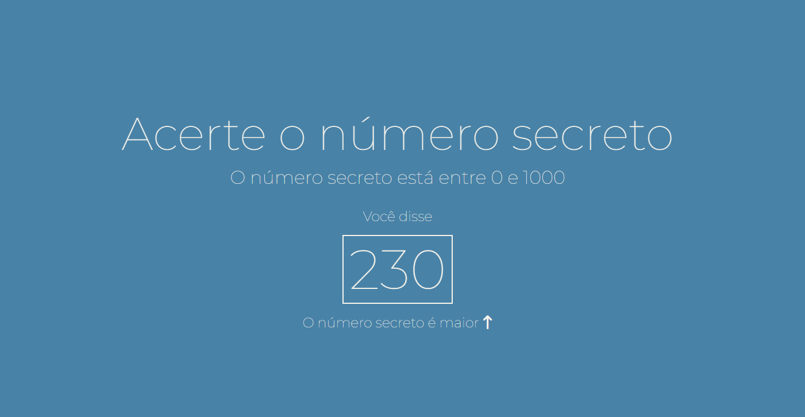
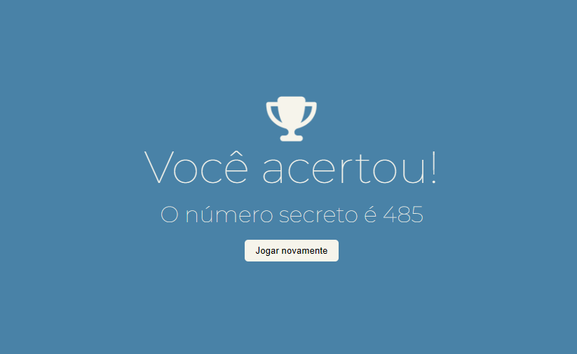

<h1 align="center"> Projeto Número Secreto </h1>

Projeto que utiliza o reconhecimento de voz para simular um jogo no qual os participantes precisam adivinhar o número secreto.

    
    
    

  
  

## Regras

- O jogo é intuitivo, portanto a única regra é que não existem regras. 

## Tecnologias

Esse projeto foi desenvolvido com as seguintes tecnologias:

- HTML e CSS
- JavaScript
- Git e Github

## Link
<a href="https://gd0385.github.io/numero-secreto/" target="_blank">Número Secreto</a>

## Licença

Esse projeto está sob a licença MIT.